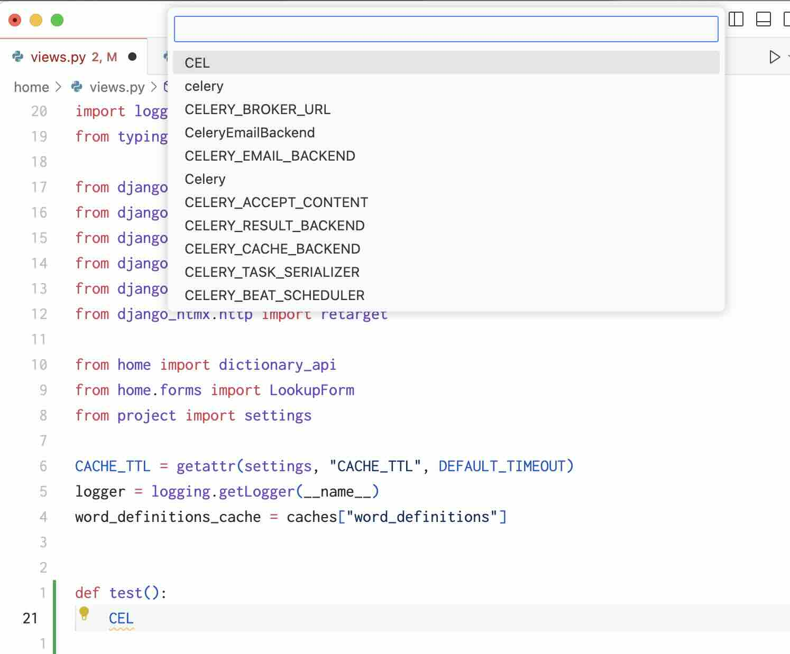

# Yaws

This is yet another word based suggestions extension. It shows of list of words from all open text documents that start with the current word.

I've created this extension because none of the current similar extensions works for my use case. The native word based suggestions with `allDocuments` setting is not working for me either.

The use case that this extension is designed for is to complete a **keyword** that is present in any of the open text documents. The keyword should be a fairly unique word, such as class name. This extension will not work well when you try to use it to complete common words (see known issues).

## Features

## Extension Settings

You can assign a shortcut to command with this is `yaws.suggestWord` to show the suggestions.

## Known Issues

- You have to type at 3 characters to trigger the suggestion list. This is by design to limit the number of suggestions. The list could be potentially large because the extensions show matches from all open documents.
- The matching algorithm is a simple regex match that is case insensitve.
- This extension can be slow if you have too many large text documents open.
- When vscode first starts, you have to view the documents at least once otherwise the document text is not loaded and will not be used to match.
